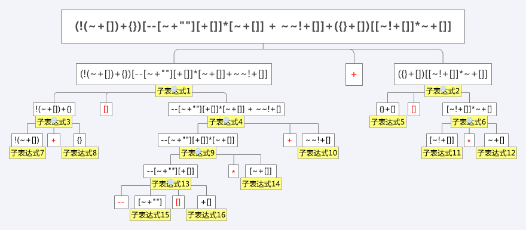

# [一行神奇的javascript代码](http://www.cnblogs.com/lvdabao/p/4280518.html)

```javascript
(!(~+[])+{})[--[~+""][+[]]*[~+[]] + ~~!+[]]+({}+[])[[~!+[]]*~+[]]
```

## 运算符优先级（从高到低）

__运算符__ | __说明__
---------- | --------
`.` `[]` `()` | 字段访问、数组索引、函数调用和表达式分组
`++` `--` `~` `!` `delete` `new` `typeof` `void` | 一元运算符、返回数据类型、对象创建、未定义的值
`*` `/` `%` | 相乘、相除、求余数
`+` `-` `+` | 相加、相减、字符串串联
`<<` `>>` `>>>` | 移位
`<` `<=` `>` `>=` `instanceof` | 小于、小于或等于、大于、大于或等于、是否为特定类的实例
`==` `!=` `===` `!==` | 相等、不相等、全等，不全等
`&` | 按位“与”
`^` | 按位“异或”
`|` | 按位“或”
`&&` | 逻辑“与”
`||` | 逻辑“或”
`?:` | 条件运算
`=` `OP=` | 赋值、赋值运算（如 += 和 &=）
`,` | 多个计算

根据此规则，我们把这一串运算分为以下16个子表达式：



## 类型转化

* 减号`-`，乘号`*`，肯定是进行数学运算，所以操作数需转化为number类型。
* 加号`+`，可能是字符串拼接，也可能是数学运算，所以可能会转化为number或string
* 一元运算，如`[]`，只有一个操作数的，转化为number类型

### 转化规则

* 1. 对于非原始类型的，通过ToPrimitive() 将值转换成原始类型：

`ToPrimitive(input, PreferredType?)`

可选参数PreferredType是Number或者是String。返回值为任何原始值.如果PreferredType是Number,执行顺序如下：（参考：[http://es5.github.io/#x9.1](http://es5.github.io/#x9.1)）

1. 如果input为primitive，返回
2. 否则，input为Object。调用 obj.valueOf()。如果结果是primitive,返回。
3. 否则，调用obj.toString(). 如果结果是primitive,返回
4. 否则，抛出TypeError
5. 如果 PreferredType是String，步骤2跟3互换，如果PreferredType没有，Date实例被设置成String，其他都是Number

* 2. 通过ToNumber()把值转换成Number，直接看ECMA 9.3的表格[http://es5.github.io/#x9.3](http://es5.github.io/#x9.3)

__参数__ | __结果__
-------- | --------
undefined | NaN
null | +0
boolean | true被转换为1,false转换为+0
number | 无需转换
string | 由字符串解析为数字。例如，"324"被转换为324

* 3. 通过ToString()把值转化成字符串， 直接看ECMA 9.8的表格[http://es5.github.io/#x9.8](http://es5.github.io/#x9.8)

__参数__ | __结果__
-------- | --------
undefined | "undefined"
null | "null"
boolean | "true" 或者 "false"
number | 数字作为字符串。比如，"1.765"
string | 无需转换
